# Tracklet-Centric RMOT Method Figure

```mermaid
flowchart LR
    classDef input fill:#eef4ff,stroke:#4a6ee0,stroke-width:1.2px,color:#111;
    classDef module fill:#f7f8fa,stroke:#6b7280,stroke-width:1.1px,color:#111;
    classDef memory fill:#eefbf3,stroke:#2f9d62,stroke-width:1.1px,color:#111;
    classDef output fill:#fff6e8,stroke:#d48a1f,stroke-width:1.2px,color:#111;
    classDef note fill:#fff1f2,stroke:#d14b61,stroke-width:1px,color:#111,stroke-dasharray: 4 3;

    Q["Referring Expression<br/>`the white car behind the bus`"]:::input

    subgraph V["Video Frames"]
        direction LR
        F1["Frame t"]:::input
        F2["Frame t+1"]:::input
        F3["Frame t+2"]:::input
    end

    P["Open-Vocabulary Proposal Generation<br/>GroundingDINO / YOLO-World / OWL-ViT"]:::module
    D["Per-frame Detections<br/>boxes + scores + category text"]:::module
    T["Tracklet Construction<br/>association / tracking across frames"]:::module

    subgraph C["Candidate Tracklets"]
        direction TB
        TA["Tracklet A<br/>blue car boxes across frames"]:::module
        TB["Tracklet B<br/>bus boxes across frames"]:::module
        TC["Tracklet C<br/>black car boxes across frames"]:::module
    end

    M["Tracklet-Centric Visual-Language Memory<br/>sample keyframes and summarize each tracklet"]:::memory

    subgraph MEM["Structured Tracklet Memory"]
        direction TB
        MA["Tracklet A<br/>category: car<br/>attribute: white<br/>relation: behind bus<br/>motion: forward"]:::memory
        MB["Tracklet B<br/>category: bus<br/>attribute: dark<br/>motion: forward"]:::memory
        MC["Tracklet C<br/>category: car<br/>attribute: black<br/>relation: right side"]:::memory
    end

    S["Structured Query Decomposition<br/>target category + attributes + relations"]:::module
    R["Query-Tracklet Matching and Verification<br/>category + attribute + relation + temporal scores"]:::module
    O["Referred Object Tracks<br/>selected target tracklets over time"]:::output

    N["Tracklet-centric means reasoning over trajectory fragments,<br/>not isolated frame-level boxes."]:::note

    V --> P
    Q --> S
    P --> D --> T
    T --> C
    C --> M --> MEM
    S --> R
    MEM --> R
    R --> O
    T -. core idea .-> N
```

## Suggested Figure Caption

**Overview of the proposed tracklet-centric zero-shot RMOT framework.**  
Given a video and a referring expression, the method first generates open-vocabulary proposals and associates them into candidate tracklets. Instead of grounding language on isolated frame-level boxes, it performs visual-language reasoning at the tracklet level by building structured tracklet memories from keyframes, then matches them with decomposed query constraints to predict the referred object tracks.

