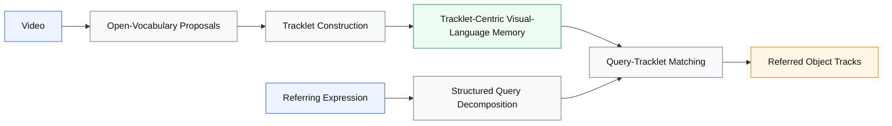

# Compact Tracklet-Centric RMOT Figure

## Suggested Caption

**Overview of the proposed tracklet-centric zero-shot RMOT framework.**  
Given a video and a referring expression, the method first generates open-vocabulary proposals and associates them into candidate tracklets. It then performs visual-language reasoning at the tracklet level by building structured tracklet memories, which are matched with decomposed query constraints to predict the referred object tracks.

